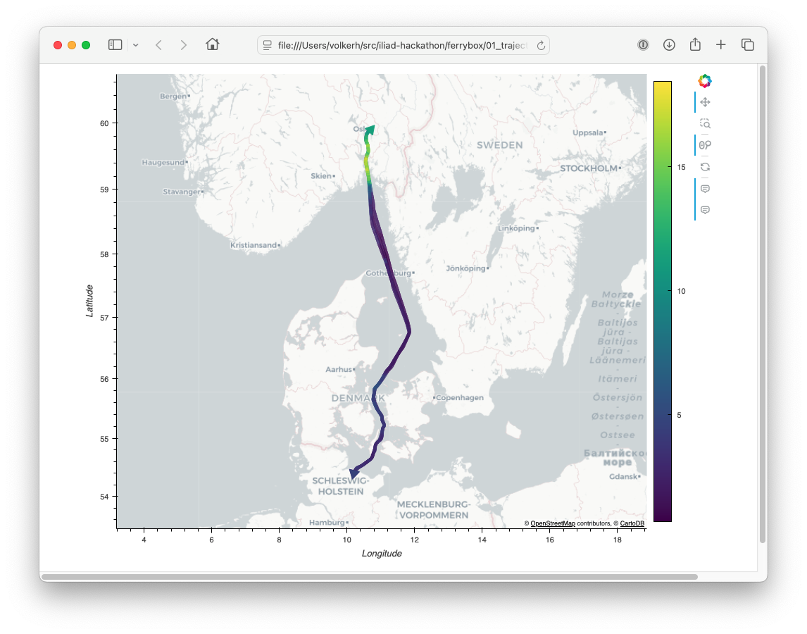
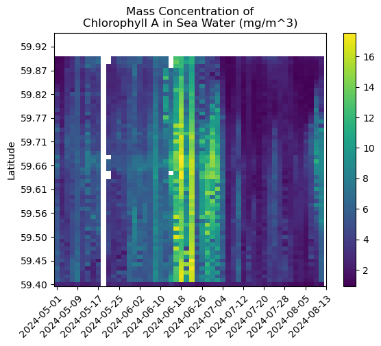
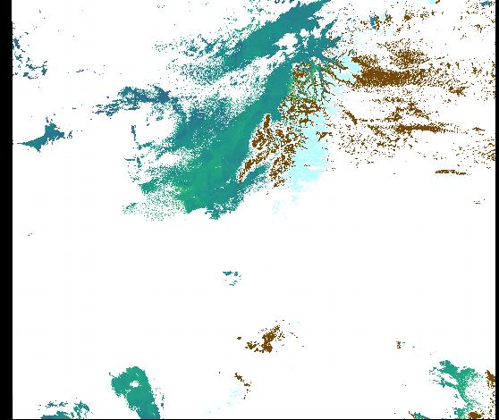
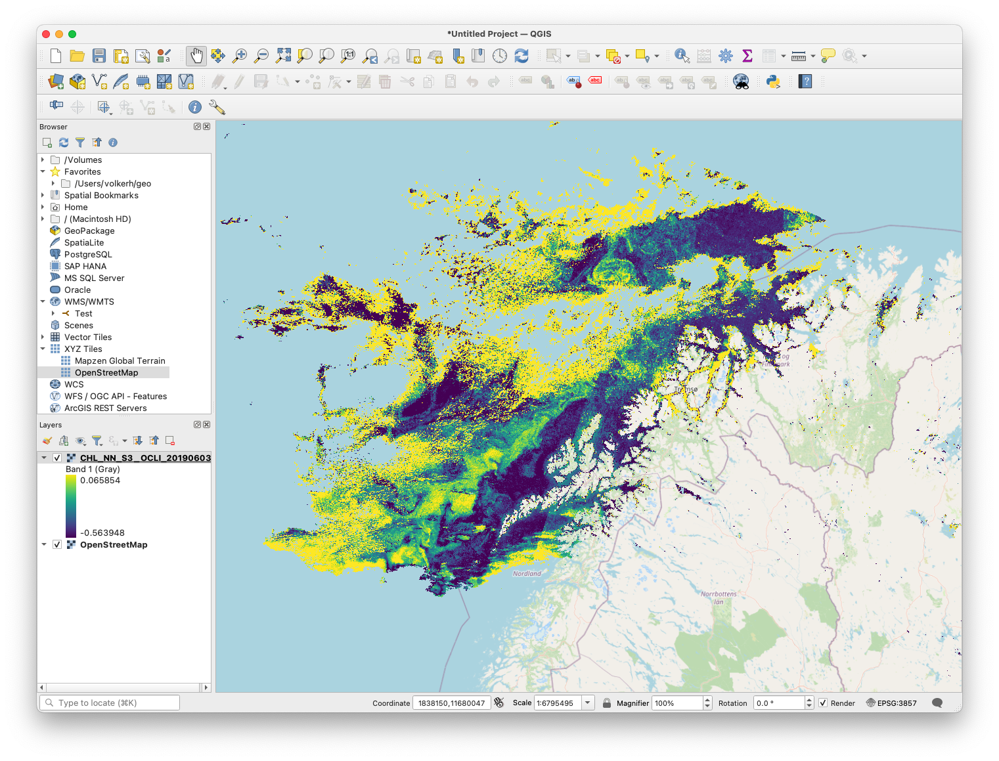

# ILIAD Hackathon, Aquaculture

## Purpose

This repository contains various notebooks created during the [2024 ILIAD Hackathon](https://ocean-twin.eu/hackathon-digital-twins-of-the-ocean). Our case focused on extraction of chlorophyll measurements from (a) ferryboxes, and (b) satellite imagery. See the notebooks in the folders `./ferrybox` and `./satellites` for details.

The notebooks also conveniently illustrate the tools available to work with remote [THREDDS Data Servers](https://www.unidata.ucar.edu/software/tds/) through [OPeNDAP](https://www.opendap.org/) using [xarray](https://xarray-datatree.readthedocs.io/en/latest/), how to use [MovingPandas](http://movingpandas.readthedocs.io) to deal with trajectories, how to use [PySTAC-Client](https://pystac-client.readthedocs.io/en/stable/) to deal with [STAC](https://stacspec.org/en/) catalogues, and how to use [Satpy](http://satpy.readthedocs.io) to deal with diverse satellite data products with little pain.

## Prerequisites

We do need an uncomfortably large collection of Python packages. Using Miniforge, you can get started as follows:

```sh
conda create --name iliad-hackathon python=3.12
conda activate iliad-hackathon
mamba install numpy ipython jupyterlab xarray pandas
mamba install tqdm
mamba install geopandas movingpandas holoviews geoviews 
mamba install satpy pystac pystac-client
```

This should pull in everything you need. Since we're pulling from `conda-forge` (where versions move fast), we chose not provide an `environment.yml` file.

## Usage, Ferrybox

In the  `./ferrybox` folder, you will find the following notebooks.

| Notebook                          | Description                                                  |
| --------------------------------- | ------------------------------------------------------------ |
| `01_trajectories_with_data.ipynb` |Load ferrybox data from the NIVA Thredds server, select some trajectories, load them into a Moving Pandas, and then visualize chlorophyll measurements along the trajectory.|
|`02_heatmap_1D_singletrip.ipynb`|Load ferrybox data from a single trip, extracts relevant data into a target grid of latitudes (along the Oslofjord), and then plots the spatial variation of chlorophyll with latitude.|
| `03_heatmap_2D_manytrips.ipynb` | As above, but loads multiple ferrybox trips and creates a timespace heatmap of how chlorophyll changes with latitude. |

The first notebook generates a HTML file (`./ferrybox/01_trajectories_with_data_sample.html`) that contains only the interactive visualization of the trajectories. The HTML file looks like this:



The timespace heatmap from the third notebook (`03_heatmap_2D_manytrips.ipynb`) looks like this:



## Usage, Satellite Data

In the `./satellites/` directory, you will find the following notebooks.

| Notebook                          | Description                                                  |
| --------------------------------- | ------------------------------------------------------------ |
| `01_search_stac_on_cdse.ipynb` |Explores the STAC endpoint of the Copernicus Dataspace (CDS) that allows you to query available satellite products for a given area of interest and time.|
|`02_download_from_cdse.ipynb`|Downloads the compressed Sentinel-3 OCLI Level 2 data from the Copernicus Data Space. Data is downloaded in the SAFE format.|
| `03_unzip.sh` | Unzip the archives you just downloaded. |
| `04_inspect_product_coordinates.ipynb` | Loads the coordinates coordinates of the downloaded product to find out whether we have a regular or irregular grid. |
| `05_with_satpy_to_geotiff.ipynb` | Uses `Satpy` to loads, reproject, plot, and export a `GeoTiff` of the CHL_NN product. |

In addition to links to the full data products, the first notebook also gives links to download quicklook previews. For the target area and time, the quicklook image looks like this. This a bit of lucky break because the entire picture is covered by clouds except Northern Norway (which we are interested in right now). Usually, it is the other way around.



Finally, by dragging the GeoTiff from by the last notebook into [QGIS](https://qgis.org) , you can produce the following figure.



## Contact 

- Volker Hoffmann (volker.hoffmann@sintef.no)

## Funding

This work was supported by EU Horizon 2020 and Horizon Europe Research and Innovation Programmes under Grant Agreement No 101037643 and 101094434 (projects [ILIAD](https://ocean-twin.eu) and [AquaINFRA](https://aquainfra.eu)).
